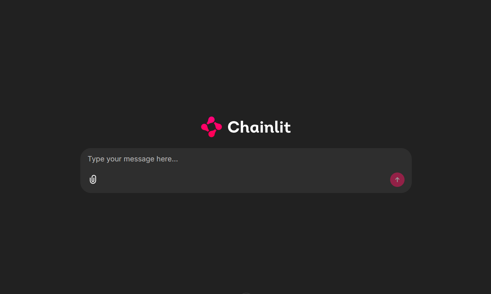
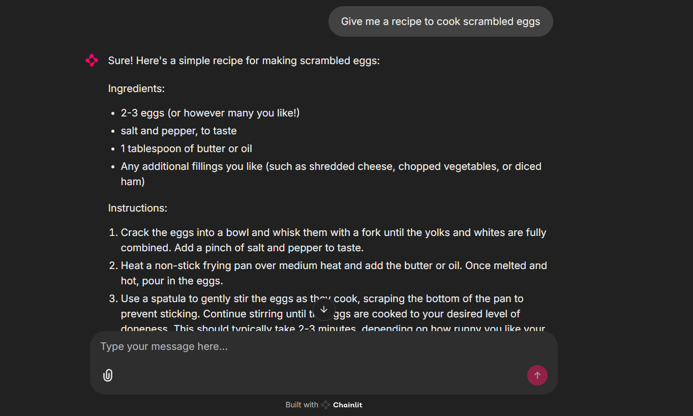

# MistralChain
A lightweight interactive AI app built with Chainlit and powered by the Mistral 7B language model. Designed for flexible experimentation and rapid prototyping.

<p align="center">
  
  
</p>


## Features
🧠 Powered by the open-source Mistral 7B model

⚡ Rapid prototyping via Chainlit UI

💬 Interactive chat-based interface

🧪 Ideal for testing and integrating custom prompts or workflows

🧼 Includes linting tools for clean and consistent code

## Installation

### 1. Clone the repository
```bash
git clone https://github.com/edcalderin/MistralChain.git
cd MistralChain
```

### 2. Create and activate the Poetry environment
```bash
# Create the env directory within the project
poetry config virtualenvs.create false --local

# Create a new Poetry environment
poetry install --no-root

# Activate the environment
poetry env activate
```

### 3. Verify the installation
```bash
# Verify that the environment is active
poetry env info

# The activated environment should appear first.
```

## Usage
Run
```bash
python -m chainlit run src/chainlit.py
```

### Lint
Style the code with Ruff:

```bash
ruff format .
ruff check . --fix
```
### Removing the environment
When you're done working on the project, remove the Poetry environment:

```bash
poetry env remove
```

## Optional

Remove the downloaded model from your system.
* Go to `.cache/huggingface/hub/` and delete the model directory.

## Acknowledgments
Thanks to the Medium community, Chainlit contributors, and the open-source ML ecosystem that enables continuous learning and innovation.

## Contact
**LinkedIn:** https://www.linkedin.com/in/erick-calderin-5bb6963b/  
**e-mail:** edcm.erick@gmail.com
